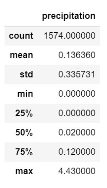
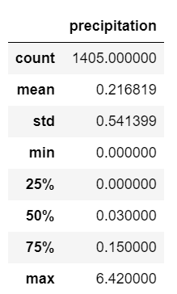

# Surfs_Up
Module 9 Analysis
## Overview of Project
Weather analysis for investor opening a Surf ad Shake shop, serving surfboards and ice cream to locals and tourists in Oahu. The investor wants to determine if the surf and ice cream shop business is sustainable year-round.
## Purpose
This project aims to analyze the temperature trends for June and December using SQLite, SQAlchemy, Jupyter Notebook, and VS Code.
## Results
### Temperature Results for June

### Temperature Results for December

- The MAX temperature for June and December differ by 4°F
  - June: 85°F
  - December: 83°F
- The MIN temperature for June and December differ by 8°F
  - June: 64°F
  - December: 56°F
- The AVG temperature for June and December differ by 3°F
  - June: 74.9°F
  - December: 71°F
  
### Precipitation Results for June

### Precipitation Results for December

## Summary
Per the temperature analysis, the weather is comparable year-round. When analyzing the precipitation in June and December, the MAX precipitation ranges from 4 to 6 inches of rain. The average precipitation ranges from 0.13 inches to 0.21 inches. According to these results, the Surf and Shake shop business is sustainable year-round.
