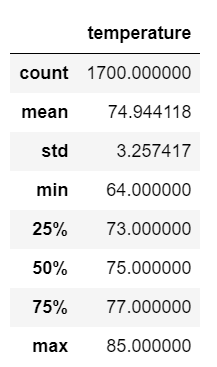
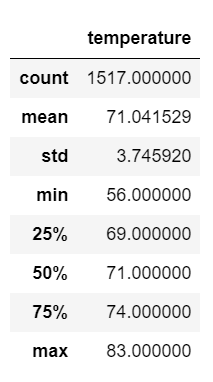

# Surfs_Up
Module 9 Analysis
## Overview of Project
Weather analysis for investor opening a Surf ad Shake shop, serving surfboards and ice cream to locals and turists in Oahu. Investor wants to determine if the surf and ice cream shop business is sustainable year-round.
## Purpose
The purpose of this project is to analize the temperature trends for June and December using SQLite, SQAlchemy, Jupyter Notebook, and VS Code.
## Results
### Weather Results for June

### Weather Results for December

- The MAX temperature for June and December differ by 4°F
  - June: 85°F
  - December: 83°F
- The MIN temperature for June and December differ by 8°F
  - June: 64°F
  - December: 56°F
- The AVG temperature for June and December differ by 3°F
  - June: 74.9°F
  - December: 71°F

## Summary
